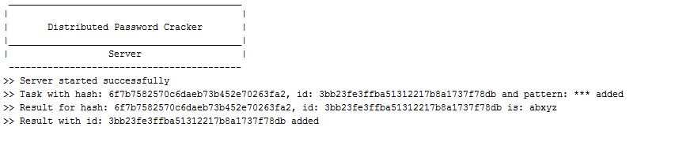
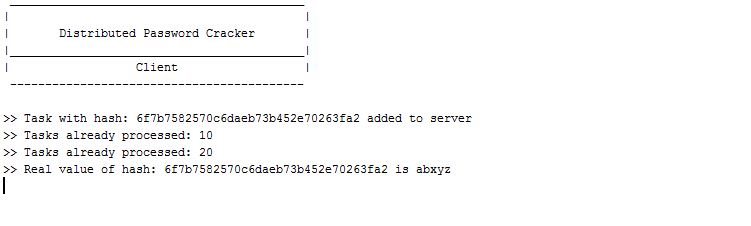
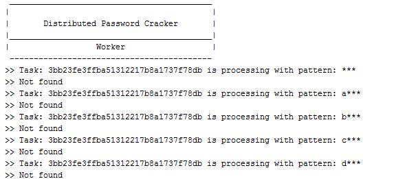
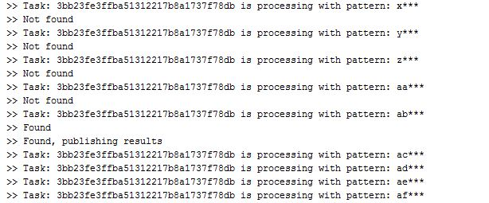

### Simple demo of distributed computational system for hashed password cracking.

#### Idea 
Use Rabbit MQ message broker to distribute easily computable tasks to unlimited number of connected workers.
Single server instance handle information exchange between clients, workers and Rabbit MQ.

#### Prerequisites
[Rabbit MQ](https://www.rabbitmq.com/download.html) installed and running.

    
    
#### Architecture
<pre>
                      _____________________________________________________________________
                     |                          result - found                             |
            ________\/_______                      _________________                       |
           |                 |     add task       |                 |<----------------> worker 1
           |     Server      |------------------->|    Rabbit MQ    |          ....
           |_________________|                    |_________________|<----------------> worker n
             /\   |         |
             |    |   msg   |
   hash      |    | already |  plain-text password
'df2k...x5'  |    |    x    |      'qwerty'
            _|____\/_______\/_
           |    client 1      |
           |__________________|
</pre>

    
#### Run
        1. cd distributed-password-cracker/runners
        2. ruby server_runner.rb
        2. ruby client_runner.rb
        3. ruby client_runner2.rb
        4. ruby worker_runner.rb
        5. ruby worker_runner.rb
        
        Now you have two clients waiting for their passwords to be cracked. 
        While two workers continously tries to get new tasks from Rabbit MQ.
        Make some calculations and put new tasks to Rabbit MQ.
        When worker find plain-text password for given hash this information is forwarded to the server.
        Now server return the result to client which requested it.
        
        NOTE: You can run as many clients and workers as you need.
         
         
              
#### Sample run screens

#### Tasks
In module Conf (file config.rb) PATTERN constant is defined. It is '\*\*\*' by default.
It means that each task requires to calculate 26^3 = 17576 hash combinations. At the beginning 26 tasks are added to queue.
 
a\*\*\* 
b\*\*\* 
... 
z\*\*\* 

When first worker pull first tasks (a\*\*\*). It checks all combinations from aaaa to azzz.
If answer is not found it creates 26 new tasks from aa*** to az*** and publish it to queue. 
This process is continued until searched result is found (password is cracked).
